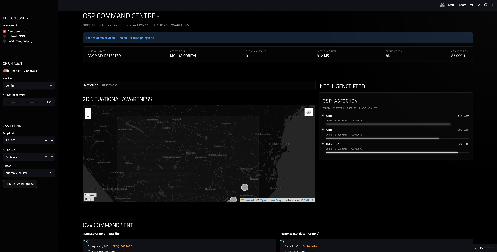

# Orbital Scene Preprocessor

https://osp-command-centre.streamlit.app/



---

> Target Platform: MOI-1A (100TOPS GPU / 4GB VRAM / OrbitLab Environment)

## 1. Executive Summary
OSP transforms MOI-1A from a passive sensor into an **Active Analyst**. By shifting compute-heavy perception to the edge, OSP delivers a compression ratio of ~85,000:1 (downlinking a 1.2KB JSON brief instead of a 100MB+ raw file). This provides >99.99% bandwidth reduction per scene at near-zero RF cost. Utilizes protobuff and token-mapping.

---

## 2. Product Vision
Turn OrbitLab into a Semantic API for Earth Intelligence.

* On-Board: 6-band quantized feature extraction.
* Downlink: Minimalist metadata "tokens."
* Ground-Side: 2D Situational Awareness map + LLM reasoning.
* Spectral Logic: Exploits Short-Wave Infrared (SWIR) reflectance contrast (B11/B12) to identify man-made vessel materials that exhibit distinct spectral fingerprints compared to ocean water, even in low-visibility conditions.

---

## 3. Functional Requirements

| Feature | Requirement | Implementation Detail |
| :--- | :--- | :--- |
| **Spectral Detector** | 6-band object detection (B2, B3, B4, B8, B11, B12). | YOLOv8n with 6-channel stem-swap; INT8 quantized. Post-processing (NMS) runs on-board for clean JSON output. |
| **Spectral Handling** | Utilize NIR (B8) and SWIR (B11/12). | B11/B12 resampled to 10m via bilinear interpolation for spatial alignment with RGB/NIR grid. Exploits SWIR reflectance contrast for dark-ship detection through light atmospheric haze |
| **JSON Schema** | LLM-ready <2KB payload. | Includes: `scene_id`, `cloud_cover`, `anomalies: [{type, lat_lon, conf}]`. |
| **Command Center** | 2D Interactive Map Dashboard. | **Streamlit + Leaflet/Folium**: Visualizes tile footprints and anomaly pins. |
| **LLM Reasoning** | Ground-side "Analyst" wrapper. | **Gemini 1.5 Pro**: Parses JSON to generate risk-weighted alerts. |

---

## 4. OVV API Contract & Deployment Spec

### OVV API Contract (Closed-Loop Verification)
* Request (Ground → Sat): `{"request_id": "REQ-001", "target_coords": [lat, lon], "reason": "high_uncertainty", "priority": 1}`
* Response (Sat → Ground): `{"status": "scheduled", "eta_minutes": 92, "payload_format": "256x256_crop_base64"}`

### Deployment Specification (OrbitLab Container)
* Image: Dockerized Python 3.10 / ONNX Runtime-GPU.
* Resource Caps: `--gpus 1 --memory 4g --cpus 2`.
* Mount Points: `/input` (Source L2A tiles), `/output` (JSON telemetry).
* Throughput: Batch mode processing; target latency **<800ms** per 1km² tile at INT8.

---

## 5. Non-Goals
* Real-time AIS fusion or terrestrial database integration.
* Flight-hardware radiation hardening certification.
* Full-scale atmospheric correction engine (L2A assumed).
* Dynamic quantization-aware training (QAT) for on-orbit updates.
* Regulatory compliance for encrypted RF cross-links.
* Training Data Scope: Simulates multispectral inference using domain-adapted RGB weights (channel mapping) due to current scarcity of public labeled multi-spectral detection datasets.

---

## 6. Success Metrics

| Metric | Target | Why TM2S Cares |
| :--- | :--- | :--- |
| Compression Ratio | >99.99% (85,000:1) | Reduces RF downlink load, maximizing the value of $2/min OrbitLab compute. |
| Model Size | <3MB (INT8) | Enables concurrent co-location with other OrbitLab user apps. |
| Inference Latency | <800 ms (INT8) | Ensures real-time anomaly flagging during orbital pass. |
| Reproducibility   | Deterministic Execution | Critical for mission-assurance and ground-side debugging. |

---

# Deployment & Local Simulation
OSP is designed for the MOI-1A OrbitLab environment but can be fully simulated locally using the provided Dockerized sandbox.

Prerequisites
Hardware: NVIDIA GPU (Optional, defaults to CPU) | 4GB+ RAM.
Environment: Conda or Python 3.10.

1. Environment Setup
```
# Create the orbital-class environment
conda create -n osp_dev python=3.10 -y
conda activate osp_dev# Install mission-critical dependencies
pip install -r requirements.txt
```

2. Synthetic Data Generation
Since raw 6-band L2A satellite data is heavy, use the OSP Synth-Engine to generate test tiles:

```
python data/synth_demo.py --n_train 20 --out data/input_debug
```

3. Model Export (The "Stem-Swap")
OSP utilizes a custom 6-channel YOLOv8n stem. To generate the deployment-ready ONNX artifact:

```
python satellite_export.py
```

4. Run the Edge Inference Engine
Simulate the on-orbit preprocessor. This will transform ~100MB of raw spectral data into a <2KB JSON brief.
Bash

```
python inference/engine.py \
--model model/artifacts/osp_yolov8n_int8.onnx \
--tiles data/input_debug/images/train \
--out data/telemetry_out
```

5. Launch Command Centre
Visualize the 2D tactical map, 3D orbital globe, and LLM-powered "ORION" risk analysis:

```
streamlit run ground/dashboard.py
```

# GenAI capabilities 

OSP extends beyond traditional object detection by integrating grounded Generative AI directly into the orbital intelligence pipeline. Instead of treating the language model as a simple summarization layer, the system uses structured reasoning to transform compact anomaly telemetry into actionable mission intelligence. The onboard inference engine extracts semantic signals from multispectral imagery, while the ground-side GenAI stack evaluates uncertainty, retrieves contextual knowledge, and generates risk-aware operational decisions.

The project incorporates Retrieval-Augmented Generation (RAG) to reduce hallucination risk and improve explainability. Maritime rules, restricted-zone policies, historical anomaly logs, and spectral heuristics are indexed using a vector database and retrieved dynamically during analysis. This allows the reasoning engine to ground every generated assessment in domain-specific evidence instead of relying solely on model priors. The result is a more reliable and auditable intelligence workflow suitable for safety-critical environments.

OSP also introduces episodic memory and agentic mission orchestration. Detection events are persisted across orbital passes, enabling the system to identify recurring anomalies and reason temporally rather than treating every scene independently. A lightweight orbital mission controller autonomously performs retrieval, reasoning, uncertainty evaluation, and OVV scheduling through a structured detect → retrieve → reason → decide → log pipeline. This transforms the system from a passive detector into an active orbital intelligence agent capable of initiating follow-up actions.

The overall architecture combines edge AI, multimodal perception, semantic compression, grounded LLM reasoning, and explainable decision-making into a unified Earth observation system. By coupling onboard multispectral inference with structured GenAI workflows, OSP demonstrates how modern satellite systems can evolve from raw imaging platforms into autonomous semantic intelligence infrastructure. 

Also implemented the "LLM-as-a-Judge" / Evaluation Loop framework to evaluate Grounding Accuracy (Faithfulness).

- Ground Truth Verification: It calculates the precise number of anomalies reported by the initial telemetry payload (the JSON data).
- LLM Report Extraction: It parses the LLM's returned JSON dictionary (specifically focusing on the anomaly_assessments array output by llm_analyst.py) to see what ORION actually reported.
- Faithfulness Evaluation: It directly contrasts the two outputs. If the LLM misses an anomaly, it fails with "Omission (Under-reporting)". If the LLM generates a non-existent anomaly, it fails with "Hallucination (Over-reporting)".
- Accuracy Score: It returns 1.0 if faithful, and 0.0 if any hallucination/omission occurs, directly feeding the metric for your "End-to-End Metrics" slide.
